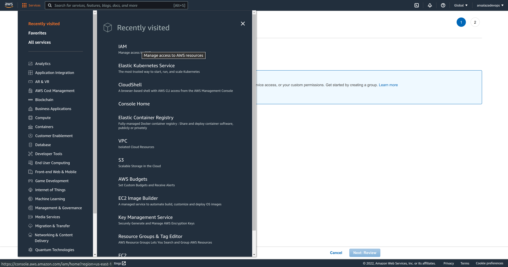
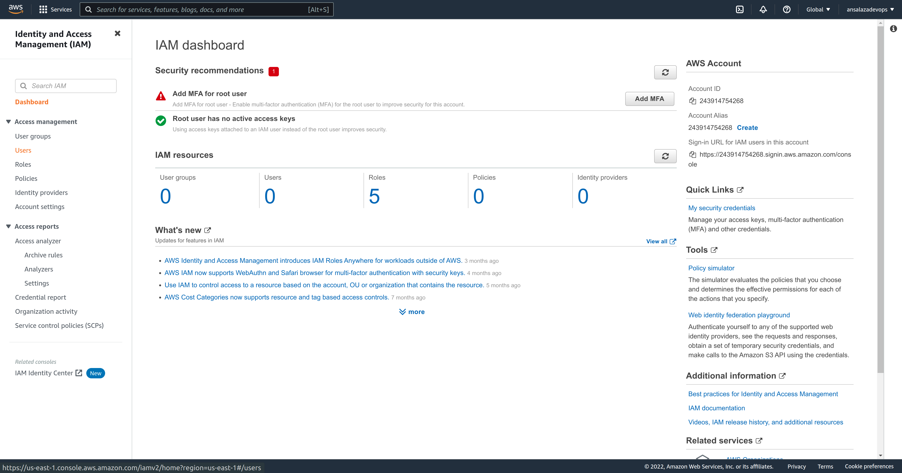
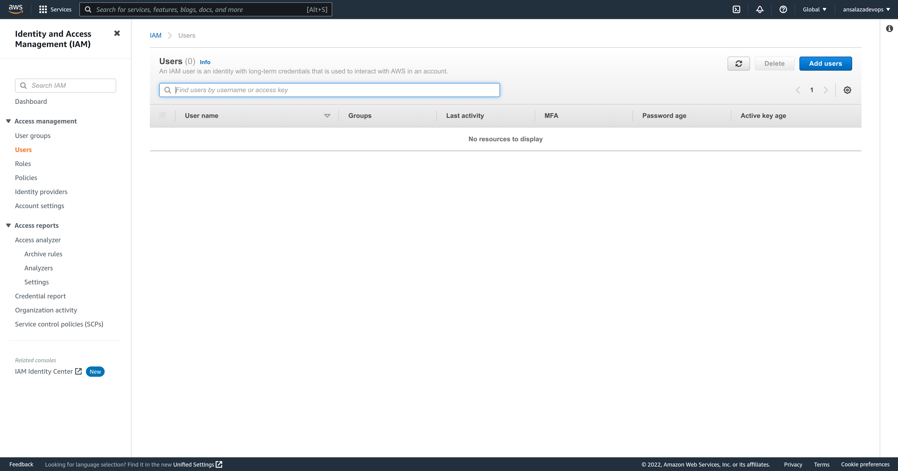
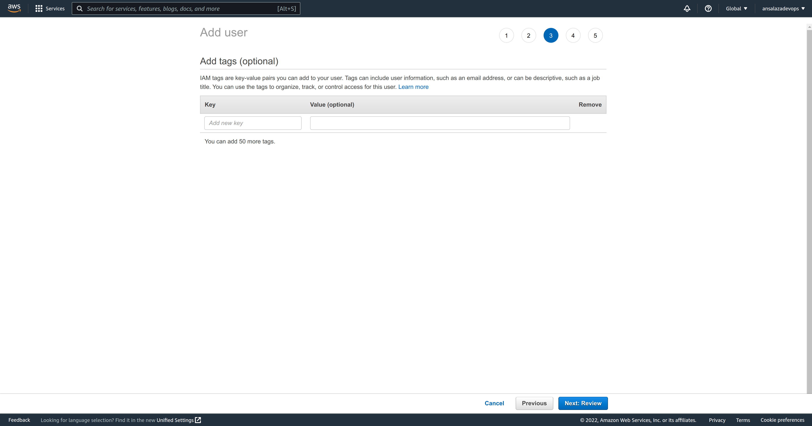
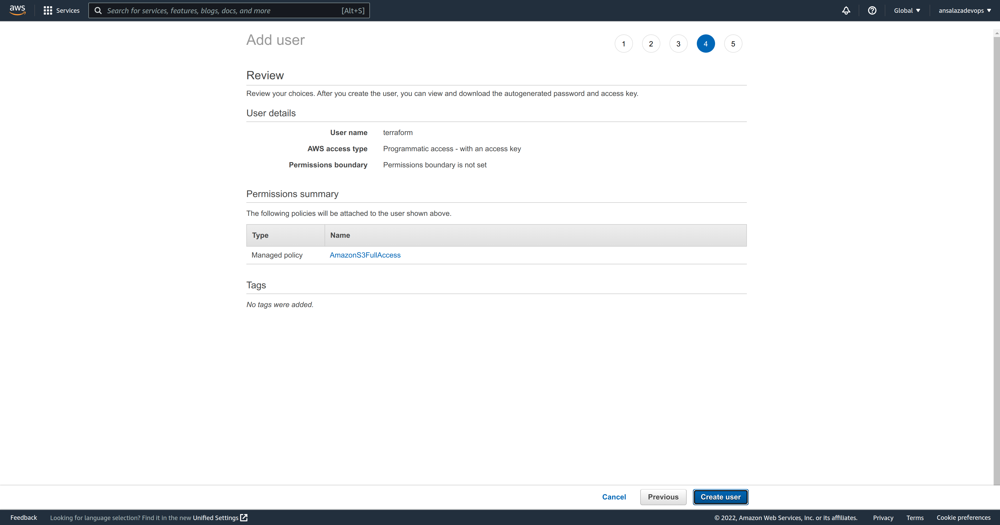
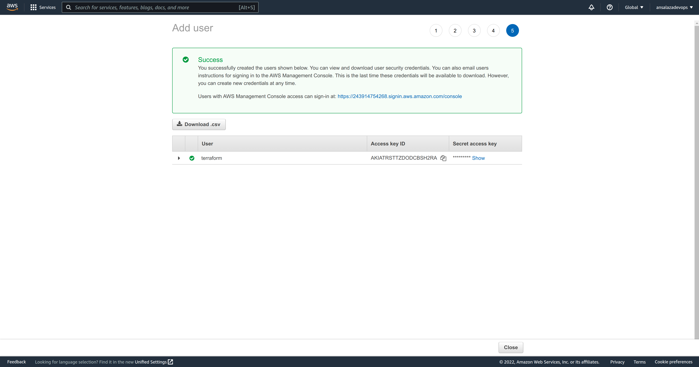

# :notes: AWS Create a programmatic user account

By [Antonio Salazar](mailto:antonio.salazar.cloudops@gmail.com), September 28th, 2022.

# :paw_prints: Steps

1. Open a browser and go to [AWS Console](https://aws.amazon.com/console/). 
2. Open the **Services** menu and select the **IAM** menu option.
    
    
    
3. On the left pane under **Access Management** click on **Users**.
    
    
    
4. Click on **Add users**
    
    
    
5. Action Items: 
    1. Type **User name**
    2. Check **Select AWS credential type**: **Access key - Programmatic access** 
    3. Click on **Next: Permissions**
    
    
    
6. Action Items
    1. Select the **Attach existing policies directly** permissions
    2. Search for the policies you are looking for. (in this example **AmazonS3Full Access**, *which not recommended in public production environments*)
    3. Click on **Next: Tags**
    
    
    
7. Leave the default values and click on **Next: Review**
    
    
    
8. Click on **Create user**
    
    
    
9. Click on **Download .csv**
    
    
    
10. Rename the downloaded .csv file. (in this example renamed to **accessKeys.csv**)
    
    
    
11. **Congratulations! You are all set!**

# :books: References
- :link: [Creating an IAM user in your AWS account](https://docs.aws.amazon.com/IAM/latest/UserGuide/id_users_create.html)
